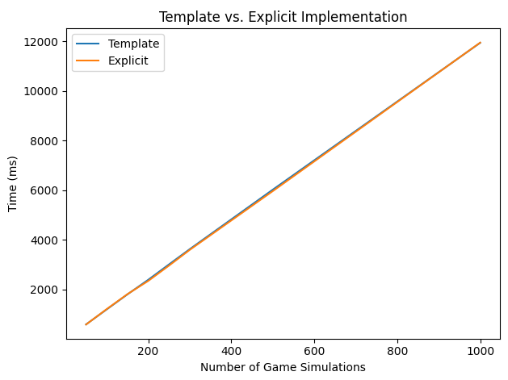
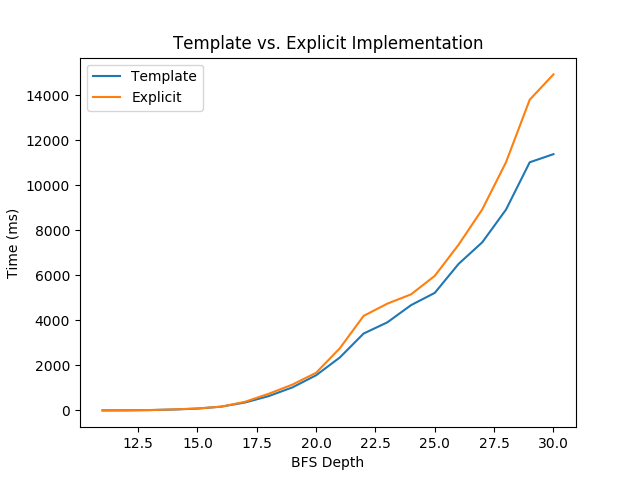
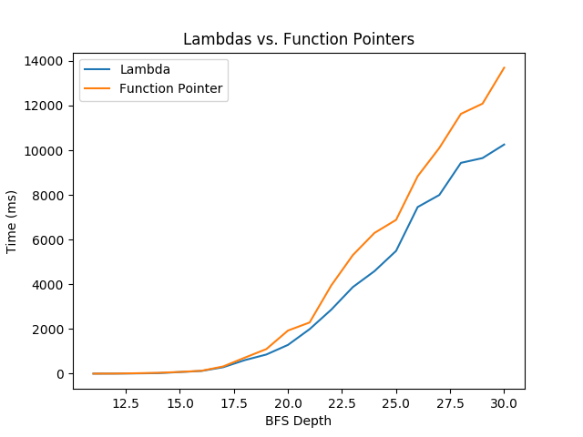

Benchmarks
==========
We focused our benchmarks in three main areas: zero cost abstraction, use of
lambdas, and in lines of code (LOC).

All coding benchmarks were run on Linux Ubuntu 20.04, with 4 vCPUs and 4096MB of
memory. The benchmark programs were compiled with `-O2` using `g++-10`.

Abstraction
-----------

### Artificial Intelligence
For the AI implementation, we compared the executation speed for two variants of
the implementation. We wanted to confirm that a non-templated verison of the
code would perform roughly the same as the templated version that afg offers.

Here, we used the TicTacToe game as a basis. We ran a non-templated version of
the minimax algorithm against the templated version; we compared times of over a
number of game simulations where two SmartPlayers use minimax against each
other.

There is essentially no difference in performance between the templated version
and the explicit implementation, thus supporting our claim that afg provides
zero cost abstraction.

### Model Checking
For the model checking implementation, we compared the execution speed for two
variants of the implementation. Like our comparison for the AI implementation,
we wanted to see if a non-templated version of the code would perform roughly
the same as the templated version that afg offers.

Here, we implemented a simple coin adding game and explored all the different
ways to sum to a large number using different denominations. This is guaranteed
to produce a large search space, which is what we wanted here – to be able to
extensively test the abstracted vs. explicit code. Here are the results (note
that the number of nodes traversed is on the order of `O(2^d)`, where `d` is
depth).

As we can see, the templated version performs slightly better than the explicit
implementation, but not significantly so. We can safely say that afg comfortably
provides zero cost abstraction.

See [benchmarks/model_abstraction.cpp](../benchmarks/model_abstraction.cpp) for
the implementation of this benchmark.

Lambdas
-------
We wanted to encourse the use of lambdas with our library, given their
expression power, succintness, and potential for being inlined by the compiler.
Inlining would certainly help out in model checking, especially given that we'll
be calling the predicate function on a number of nodes growing exponentially
with increasing depth.

For this benchmark, we took the templatized implemetation of BFS search and
substituted out the `Function` template argument for a function pointer. We
wanted to test the compiler's ability to inline lambdas with the version that
has the template argument vs. the compiler's ability to inline function pointers
when the signature of the function only expects a function pointer. Using the
same simple coin game, here are the results:

Indeed, we saw some performance improvement when we use lambdas vs. using
function pointers! While lambdas aren't necessarily a feature we are offering,
we do use them extensively in our tutorials which should encourage users to use
them too. The benefit of being able to inline the predicate function in these
exhaustive searches only increases as the depth of the space increases.

LOC
---
### Game

### Artificial Intelligence
Assuming the game is set up, we compared the lines of code that a programmer
would have to write to implement minimax with the lines of code that a
programmer would have to write to use `afg::AI::minimax`. To use
`afg::AI::minimax`, a programmer would just need 1 line of code. We looked at
several C++ implementations of minimax, which used on average 268 lines of code. 

Note that both of these numbers assume helper functions, such as heuristic, are
implemented (implementing heuristic would require the same lines of code with
`afg::AI::minimax` as a minimax implemented from scratch).

